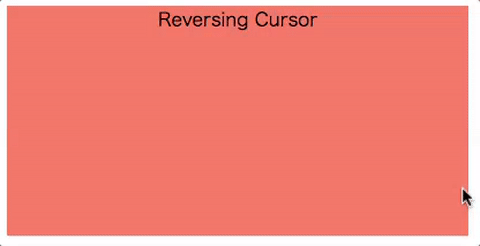
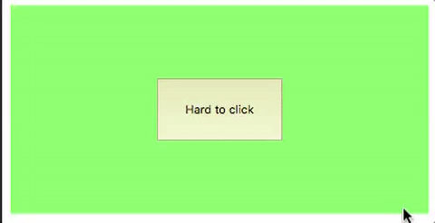
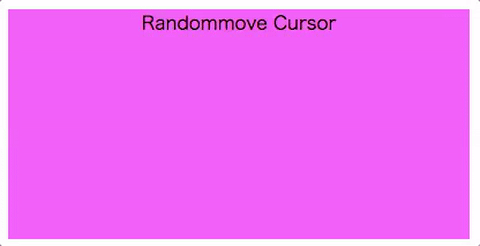

[](https://travis-ci.org/aratakokubun/cursor-hijack)
[](https://gemnasium.com/github.com/aratakokubun/cursor-hijack)

# cursor-hijack

Library to hijack cursor and control it!

## What is cursor-hijack?　Why use cursor-hijack?

Cursor-hijack is react based library to enable hijack cursor and control it.

You can create more attractive application with this library.

See [demo page](https://cursor-hijack-demo.appspot.com/demo)

[](https://github.com/aratakokubun/cursor-hijack/)
[](https://github.com/aratakokubun/cursor-hijack/)
[](https://github.com/aratakokubun/cursor-hijack/)

## How to use cursor-hijack?

1. install cursor-hijack with npm
Currently I am not registering. Please wait for it.
```
npm install cursor-hijack --save
```

2. Add 2 react components to your application.

You need to pass function to CursorHijackOverlay to get Refs under application.  
[samples index.js](https://github.com/aratakokubun/cursor-hijack/tree/master/samples/index.js)

```app.js(for exapmle)
  // Import components from cursor-hijack
  import cjk from 'cursor-hijack';
  ...

  // Pass function to get refs under app.js
  const getAppRefs = () => (this.refs)

  ...
  const render = () => {
    return
      <div>
        <cjk.PseudoCursor />
        <cjk.CursorHijackOverlay
          getAppRefs={this.getAppRefs} />
        <!-- other components -->
        <Component1 />
        <Component2 />
        ...
      <div>
  }
  ...
```

3. Put refs tags for components inside.

This library search elements with ref tag to dispatch event.  
In app.js and same manner for all child components.  

```
  ...
  <div>
    <ChildComponent1 ref="child1"> Good! </ChildComponent1>
    <ChildComponent2> Bad! You should not do this! </ChildComponent2>
    <button ref="button1"> Good! </button>
    <div>
      <ChildComponent3 ref="child3"> Good! </ChildComponent3>
      <button ref="button2"> Good! </button>
    </div>
  </div>
  ...
```

To add to this, you need to specify { withRef: true } for comoponets which use connect.
```
  connect(mapStateFunc, mapDispatchFunc, mergeFunc, { withRef: true } /*Need option*/)(Component1)
```

4. Create store for cursor-hijack reducers  
  [samples app.js](https://github.com/aratakokubun/cursor-hijack/tree/master/samples/app.js)
      
```
let store = createStore(CursorHijack.Reducers);
let rootElement = document.getElementById('app')

render(
  <Provider store={store}>
    <div>
      <App />
    </div>
  </Provider>,
  rootElement
)
```
    
5. Create and set your own distoreter.
 
<b>This is most important and difficult part.  
Read instruction below and refert to samples.</b>

In this part, I use [ReversingArea sample](https://github.com/aratakokubun/cursor-hijack/tree/master/samples/reversing-area.js) for explanation.  
First, create distorter extends CursorHijack.Distorter  

- Constructor
  - key  
  Key is string which is unique in the application.  
  - Priority    
  If multiple distorters are applied to same coordinate, distorter with HIGH priority applied first.

- isInRange  
Returns if the distorter is applied to for specified coordinates.  
Should return true(in range) or false(not in range).  
If true, distort method is executed, and distort coordinates.  
Else, distorte method is NOT executed.  

  - defaultPointer has previous and current coordinates of original mouse event.  
  - distortedPointer has previous and current coordinates of mouse event distorted by other distortes.  
    If no other distorters are applied before, this value is same as defaultPointer.  
  - prevDistortedPointer has before previous and previous coordinates of mouse event distorted by ALL distortes.  
    Result of distortion will be set to prevDistortedPointer in the distort evnet.  

- distort  
Distort (change) coordinates of cursor to another.  
Should return new CursorHiack.CursorPointer for new coordinates.  

```
class ReversingDistorter extends CursorHijack.Distorter {
  constructor(key, priority, getRangeFunc) {
    super(key, priority);
    this.getRangeFunc = getRangeFunc;
  }

  isInRange = (defaultPointer, distortedPointer, prevDistortedPointer) => {
    const range = this.getRangeFunc();
    const curX = distortedPointer.currentX;
    const curY = distortedPointer.currentY;
    return range.left <= curX && curX <= range.right
           && range.top <= curY && curY <= range.bottom;
  }

  distort = (defaultPointer, distortedPointer, prevDistortedPointer) => {
    const range = this.getRangeFunc();
    const relativeX = distortedPointer.currentX - range.left;
    const relativeY = distortedPointer.currentY - range.top;
    return new CursorHijack.CursorPointer(distortedPointer.prevX, distortedPointer.prevY, 
      range.width-relativeX+range.left, range.height-relativeY+range.top);
  }
}

const mapDispatchToProps = (dispatch) => {
  return bindActionCreators(CursorHijack.ActionCreators, dispatch);
}

export default connect(null, mapDispatchToProps, null, {withRef: true})(ReversingArea);
```

Then, bind CursorHijack.ActionCreators to component to merge event functions for add/delete distorters.
```
const mapDispatchToProps = (dispatch) => {
  return bindActionCreators(CursorHijack.ActionCreators, dispatch);
}

export default connect(null, mapDispatchToProps, null, {withRef: true})(ReversingArea);
```

Finally, instantiate and dispatch add event.  
When you finished to use the distorter, dispatch delete event.  
You can add the distorter with createAddDistorterEvent and delete it with createDeleteDistorterEvent.  

```
class ReversingArea extends React.Component {
  ... 
  constructor(props) {
    super(props);
    this.distorter = new ReversingDistorter('reversing-distorter', 100, this.getRangeFunc);
  }
  ...
  componentDidMount() {
    this.props.createAddDistorterEvent([
      this.distorter
    ]);
  }

  componentWillUnmount() {
    this.props.createDeleteDistorterEvent([
      this.distorter
    ]);
  }
  ...
}
```

6. Check if the application runs.  
Finally, build and run your application and check the result!

## Customize

TODO

## Restrictions

1. Default (real) cursor will be shown on dialogs(e.g. alert).

Cursor-hijack hide default cursor where cursor-hijack-overlay covers, but it does not cover dialog.  
If you want REALITY for a pseudo cursor, recommend not to use them.
  
2. Some actions for ui component do not occur(e.g. select test in input).

Cursor-hijack does not support some actions for ui components.
I do not have any solutions for it.
If you want to use it, please wait for update, sorry.

## Future improvements

  - Distort cursor periodically even while no mouse events occur.
  - Add more samples.
    - I am now planning to create interactive UI combined with gl sl!
  - Remove listed restrictions!
  
## Samples

This library includes some sample in [samples folder](https://github.com/aratakokubun/cursor-hijack/tree/master/samples)

These samples are run in [demo page](https://cursor-hijack-demo.appspot.com/demo)

## License

MIT
